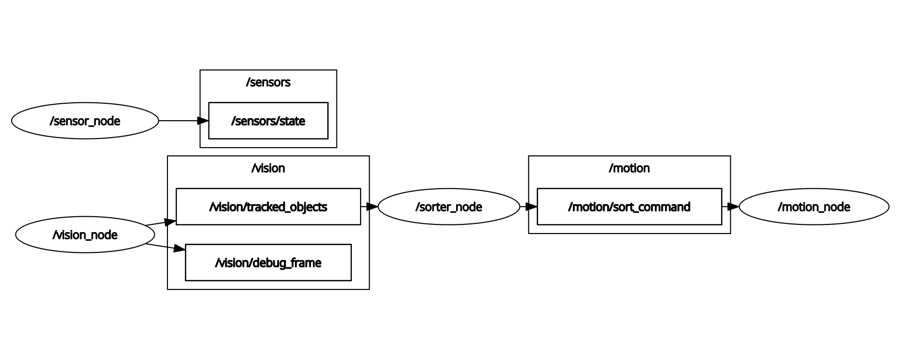

# Smart Conveyor Belt Sorting

An industrial-grade, AI-powered conveyor sorting system. This repository contains the complete software stack spanning Computer Vision (YOLOv8), Predictive Physics (Kalman Filter), ROS 2 Master Planning, and C++ Low-Level Hardware Control.

## System Documentation & Visuals
* **Miro Board (Design & Specs):** [XRbit Architecture Board](https://miro.com/app/board/uXjVHhsOcJU=/?share_link_id=101761241481)
* **Requirements & Testing Specification:** The complete functional, system, and integration test plans are heavily documented in [xrbit_requirements_spec.md](xrbit_requirements_spec.md).

### Electronics Architecture


### ROS 2 Node Computation Graph (rqt_graph)


## System Software Architecture
* **Vision Node:** Captures 60FPS video from a Basler GigE Camera and runs a YOLOv8 Neural Network to detect 8 distinct object classes.
* **Sorter Node (The Brain):** Subscribes to bounding boxes, tracks objects using a Kalman Filter physics engine, computes intercept vectors inside the camera's "Blind Zone," and triggers mechanical sorting arms.
* **Motion Node:** Translates ROS 2 commands into a highly robust, checksum-protected 5-byte binary protocol (`[0xAA, ArmID, TrayID, CHK, 0x55]`) over USB.
* **Sensor Node:** Decodes bit-packed telemetry from STM32 (SICK photoelectric entry/exit sensors and ifm inductive home sensors).

## Hardware & Electrical Architecture
* **Compute Engine:** NVIDIA Jetson Orin Nano connected to a Basler GigE PoE Camera via Cat6 M12 X-coded cable.
* **Microcontroller:** STM32F407VET6 connected to the Jetson via USB CDC (/dev/ttyACM0).
* **Actuation:** NEMA 17 Stepper Motors driven by Trinamic TMC2209 Drivers (connected via UART for StealthChop and diagnostics).
* **Sensors:** SICK W12-2 photoelectric sensors (entry/exit) and ifm IGS232 inductive sensors (arm homing), optically isolated via Phoenix Contact PLC-OPT-24DC/TTL relays.
* **Industrial Enclosure & Wiring:** 
  * Features dedicated DIN rails for 24V routing, motor drivers, and signal isolation.
  * Employs single-point bonding (Star Grounding) separating Signal GND (0V) from Protective Earth (PE) to prevent motor noise loops.
  * Uses M12 panel mount connectors (A-coded for sensors/motors, X-coded for GigE) to maintain an IP66/IP67 environmental rating on the main cabinet.
  * Integrated E-Stop physical safety relay that hard-cuts 24V power to the TMC2209 drivers while keeping the Jetson and STM32 alive for continuous telemetry.

## System Startup Sequence
1. AC Mains energizes the 24V PSU. E-Stop relay permits 24V to motor rails.
2. Step-down buck converters produce 19V for the Jetson Orin Nano and 5V for the STM32.
3. STM32 boots in 100ms, initializes TMC2209 drivers via UART, and enumerates as a USB CDC device.
4. Jetson boots Ubuntu + ROS 2, launching the Dockerized containers.
5. Camera begins GigE streaming; YOLOv8 TensorRT engine loads into VRAM.
6. System idles until the SICK photoelectric sensor triggers, starting the conveyor and sorting loop.

---

## Zero-Dependency Deployment (Production)
For the final client installation on the factory floor, this system is 100% Dockerized. You do not need to install ROS 2, Python, or CUDA on the host machine. 

1. Install Docker on the NVIDIA Jetson.
2. Clone this repository.
3. Boot the system:
   ```bash
   sudo docker compose up --build
   ```
*Note: Docker is configured to automatically launch the robot on hardware boot and securely pass-through the USB STM32 controller and GigE camera.*

---

## Local Development Setup (For Engineers)
If you are actively writing code and need to compile locally on Ubuntu 24.04 (ROS 2 Jazzy):

**1. Create a virtual environment:**
```bash
python3 -m venv --system-site-packages .venv
source .venv/bin/activate
pip install "numpy<2.0.0" scipy ultralytics filelock cmake
```

**2. Build the Workspace:**
```bash
# Force Python to ignore conflicting global packages
export PYTHONNOUSERSITE=1
source ./build_jazzy_clean.sh
```

**3. Launch the Robot:**
```bash
./run_robot.sh
```

## Testing
This repository includes rigorous Unit and Integration tests for both Python and C++ components.
```bash
colcon test
colcon test-result --all
```
